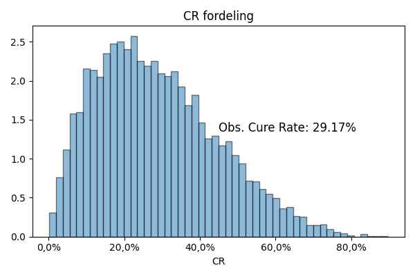
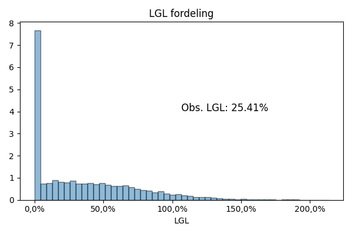

# SomersDref
Referencekode til anvendelse af Somers' D

## Grundlæggende idé

Vi skal bruge Somers' D i mgange sammenhænge i fot hold til PD og LGD modeller. Således er det måske en god idé at have lidt eksempelkode i Python (og gerne SAS) der viser, hvordan man påtænker at gøre det.

## Scope

Liste af ting vi skal kunne beregne Somers' D for (og forklare hvad vi gør)

- PD
  - Rangordningsevne af PD-estimat
  - Rangordningsevne af enkeltvariable
- LGD
  - Rangordningsevne af CR
  - Rangordningsevne af enkeltvariable i CR
  - Rangordningsevne af LGL/LGD estimater
  - Rangordningsevne af enkeltvariable
 
Hvis vi kan lave et Pythonprogram der gennemløber eksempler på alt det her og koder det op, så har vi vel gjort vores kolleger en tjeneste.

Hvis vi sågar oversætter til SAS og bekræfter, at vi får det samme, så er vi vel golden.

## Status

### PD analyser

`pd_analyser.py` indlæser den genererede portefølje (Se herunder).

Først beregnes en ROC-kurve for modellen:


Så beregnes Somers' D på tre måder:
- Direkte på PD
- Med en grov inddeling af PD i 10 intervaller (som i praksis bliver til 3 pga lave PD værdier for now.)
- Med en fin inddeling i 100 intervaller

Resultaterne viser, at
- Somers' D og AUC ganske rigtigt kan omregnes mellem hinanden
- Binning er ikke lige meget.

```
Somers D
Somers D: 0.49
Modsvarende en AUC på 0.75

Somers D (grov binning)
Somers D (binned): 0.20
Modsvarende en AUC på 0.60

Somers D (fin binning)
Somers D (binned): 0.48
Modsvarende en AUC på 0.74
```

Så kigger vi på rangordningsevnen af en enkelt variabel som jo er antaget grupperet:
```
Somers D (variabel): 0.47
Modsvarende en AUC på 0.74
```

`pd_analyser.sas` indeholder krydstjek.

ROC-kurven er den samme (med samme AUC):


Somers' D fra `PROC LOGISTIC` er:
`Somers' D = 0.494753`
... og det ser jo bekendt ud.

Kigger vi på `PROC FREQ`, ses det, at eksekveringstiden er for stor, hvis man ikke inddeler i bins, og det er jeg ikke nået til endnu.


Så det ser ud til at vi har en god metode til at rangordne PD-estimaterne.

### LGD Analyser

*Ikke rørt endnu...*

### Porteføljebyggeren

`portefoeljebygger.py` bygger både en PD portefølje og en LGD portefølje.

#### PD portefølje

Per default genereres 10.000 kontakter med følgende information:
- PD
- En beskrivende variabel til Somers' D studier
- Misligholdsflag

Fordelingen af PD for porteføljen er vist i figuren nedenfor. Det ses, at mislighold typisk har højere PD.


#### LGD portefølje

Per default genereres 10.000 kontakter med følgende information:
- CR: Estimeret cure rate
- LGL: Estimeret Loss Given Loss
- LGC: Estimeret Loss Given Cure
- LGD: Beregnet LGD $LGD = LGL \cdot (1 - CR) + LGC \cdot CR$
- cure: Cure flag
- cr_var: En beskrivende variabel til Somers' D studier
- LGD_REAL: Realiseret LGD

Et par beskrivende grafer:




Der mangler nok stadig en beskrivende variabel eller to, men mon ikke vi kan komme i gang?