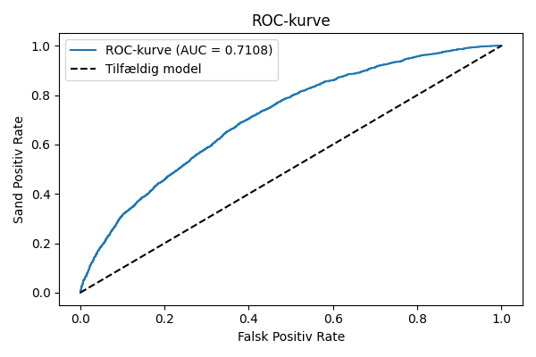

# SomersDref
Referencekode til anvendelse af Somers' D

## Grundlæggende idé

Vi skal bruge Somers' D i mange sammenhænge i forhold til PD og LGD modeller. Således er det måske en god idé at have lidt eksempelkode i Python (og gerne SAS) der viser, konsistent, hvordan man kan gøre det. Så er det mere sandsynligt, at vi gør det ens.

## Scope

Liste af ting vi skal kunne beregne Somers' D for (og forklare hvad vi gør)

- PD
  - Rangordningsevne af PD-estimat
  - Rangordningsevne af enkeltvariable
- LGD
  - Rangordningsevne af CR
  - Rangordningsevne af enkeltvariable i CR
  - Rangordningsevne af LGL/LGD estimater
  - Rangordningsevne af enkeltvariable
 
Det repository indeholder simple Pythonprogrammer der gennemløber eksempler på alt det her og koder det op så simpelt som muligt. Koden kører på simulerede porteføljer, så man senere let kan køre _what if_-scenarier.

Som supplement er tilføjet SAS-kode der gør det samme. Igen er målet simplicitet og forståelighed.


## Konkrete eksempler

### PD analyser

`pd_analyser.py` indlæser den genererede portefølje (Se herunder).

Først beregnes en ROC-kurve for modellen:


Så beregnes Somers' D på tre måder **altid med default event som uafhængig variabel**:
- Direkte på PD
- Med en grov inddeling af PD i 10 intervaller (som i praksis bliver til 3 pga lave PD værdier for now.)
- Med en fin inddeling i 100 intervaller

Grundlæggende er syntaksen:
```
from scipy.stats import somersd
SomersD, pvalue = somersd(default, p_def)
```

De to elementer kan også tilgås separat:
``` 
SomersD = somersd(default, p_def)
somersd = SomersD.statistic
pvalue = SomersD.pvalue
```


Resultaterne viser, at
- Somers' D og AUC ganske rigtigt kan omregnes mellem hinanden. AUC-værdien fra ROC-kurven genfindes.
- Binning er ikke lige meget.

```
Somers D beregnes med default event som uafhængig variabel:
Somers D: 0.5806
Modsvarende en AUC på 0.7903
Somers D (grov binning)
Somers D (binned): 0.2662
Modsvarende en AUC på 0.6331
Somers D (fin binning)
Somers D (binned): 0.5623
Modsvarende en AUC på 0.7812
```

Så kigger vi på rangordningsevnen af en enkelt variabel som antaget grupperet (og legetøjsporteføljen er konstrueret så den er det.):
```
Somers D (variabel): 0.1536
Modsvarende en AUC på 0.5768
```


`pd_analyser.sas` indeholder krydstjek.

ROC-kurven er den samme (med samme AUC):


Somers' D fra `PROC LOGISTIC` er:
`Somers' D = 0.5806`
... og det ser jo bekendt ud.

Kigger vi på `PROC FREQ`, ses det, at eksekveringstiden er for stor, hvis man ikke inddeler i bins. Således inddeles i intervaller og Somers' D beregnes.
I koden foreslås grupperingen lavet med et format. Så er den nem at distribuere ud over megen kode. Grupperingen er lavet identisk med Python, og det resulterende Somers' D er:
```
0.2662
```
Dvs. magen til Pythons bud.

### LGD Analyser

Den kode ligger i `LGD_analyser.py` Cure rate er samme historie: Vi kan lave en ROC-kurve



Somers' D lader sig også beregne:
```
Somers D: 0.4216
Modsvarende en AUC på 0.7108
```

Syntaksen er som før:
```
from scipy.stats import somersd
SomersD, pvalue = somersd(cure, cr)
```

Igen anvendes cure eventen som *u*afhængig variabel.

LGD/LGL er en anden sag. Her er vi nødt til at gruppere data for at kunne foretage beregningen i endelig tid.
Metodedokumentet for validering foreskriver denne binning: (foreslået af ECB)
- [0-5%)
- [5-10%)
- [10-20%)
- [20-30%)
- [30-40%)
- [40-50%)
- [50-60%)
- [60-70%)
- [70-80%)
- [80-90%)
- [90-100%)
- [100% -)

Syntaksen er simpel i Python:
```
# Grupperer
lgd_bin_edges = [0, 0.05, 0.1, 0.2, 0.3, 0.4, 0.5, 0.6, 0.7, 0.8, 0.9, 1]
df_lgd['lgd_real_bins'] = np.digitize(df_lgd['LGD_REAL'], lgd_bin_edges)
df_lgd['lgd_bins'] = np.digitize(df_lgd['LGD'], lgd_bin_edges)

# Beregner
somersd, pvalue = somersd(df_lgd.lgd_real_bins, df_lgd.lgd_bins)
```

Resultaterne er:
```
Somers' D for LGD med realiseret LGD som uafhængig variabel: 0.520694
Somers' D for LGL med realiseret LGL som uafhængig variabel: 0.707044
```


LGL isoleret er bare at betinge sig `cure = 0` og så køre samme stump kode.

## Er par ord om signifikans

- SAS leverer AUC, Somers' D og konfidensinterval på AUC i `PROC LOGISTIC`.
- `PROC FREQ` leverer Somers' D.
- Python leverer Somers' D og p-værdi (men ingen intervaller).
- AUC-beregningen i Python leverer bare AUC og ikke andet. Hvis man vil have konfidensintervaller, er man henvist til bootstrapping.
- Mann-Whitney-U testen er implementeret i `scipy.stats.mannwhitneyu` i Python. Bemærk, at den hviler på andre antagelser end Somers' D, så man kan ikke generelt forvente samme P-værdier.

## Porteføljebyggeren

`portefoeljebygger.py` bygger både en PD portefølje og en LGD portefølje.

### PD portefølje

Per default genereres 10.000 kontakter med følgende information:
- PD
- En beskrivende variabel til Somers' D studier
- Misligholdsflag

Fordelingen af PD for porteføljen er vist i figuren nedenfor. Det ses, at mislighold typisk har højere PD.


### LGD portefølje

Der genereres 10.000 kontakter med følgende information:
- CR: Estimeret cure rate
- LGL: Estimeret Loss Given Loss
- LGC: Estimeret Loss Given Cure
- LGD: Beregnet LGD $LGD = LGL \cdot (1 - CR) + LGC \cdot CR$
- cure: Cure flag
- cr_var: En beskrivende variabel til Somers' D studier
- LGD_REAL: Realiseret LGD

Et par beskrivende grafer:


